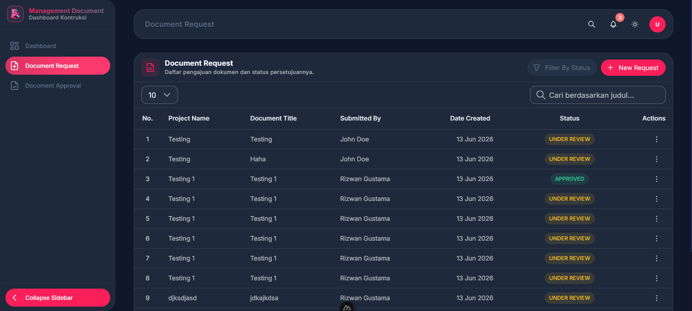

# Technical Document Management Dashboard

A modern, responsive, and robust Document Management Dashboard built with the latest Vue & Nuxt ecosystems. This application provides a seamless experience for managing document approvals and requests with a mock server-side API out of the box.

## 🚀 Tech Stack

- **Framework**: [Nuxt](https://nuxt.com/) (Vue 3 / Nitro Server)
- **Styling**: [Tailwind CSS v4](https://tailwindcss.com/) & Vanilla SCSS
- **UI Library**: [Vuetify 3](https://vuetifyjs.com/) (via `vuetify-nuxt-module`)
- **State Management**: [Pinia](https://pinia.vuejs.org/)
- **HTTP Client**: [Axios](https://axios-http.com/) (configured with interceptors)

## ✨ Key Features

- **Authentication System**: Full login flow with JWT token generation, mock validation, and secure cookie storage.
- **Document Management**: View, approve, reject, and manage document lists.
- **Dark Mode / Light Mode**: Real-time theme toggling with persistent state and custom SCSS layouts.
- **Server API Logging**: Custom Nitro middleware (`logger.ts`) that intercepts and prints HTTP requests and response payloads directly to the terminal.
- **SCSS Architecture**: Highly modular, 7-1 pattern inspired architecture for `assets/scss`.
- **Environment Driven**: Configurable via `.env` variables for seamless CI/CD integration.

## 📂 Project Structure

```text
├── app/
│   ├── assets/
│   │   ├── css/          # Tailwind entry files
│   │   └── scss/         # Modular SCSS (base, config, layouts, pages)
│   ├── components/       # Reusable Vue components (e.g., AppTable, GlobalTextField)
│   ├── composables/      # Shared logic (e.g., useAppTheme)
│   ├── constants/        # Global constants and API route definitions
│   ├── layouts/          # Vue layouts (default, blank)
│   ├── pages/            # App pages (login, dashboard, settings)
│   └── services/         # Axios API Services (Auth, Documents)
├── server/
│   ├── api/              # Mock backend Nitro endpoints
│   ├── assets/           # Local JSON database for mock API
│   └── middleware/       # Server request/response loggers
├── nuxt.config.ts        # Nuxt ecosystem configurations
└── vuetify.config.ts     # Vuetify custom themes and icons
```

## 🛠️ Setup & Installation

### 1. Clone the repository

```bash
git clone https://github.com/rizwangustama/technical-document.git
cd technical-document
```

### 2. Install Dependencies

Ensure you have Node.js installed, then run:
```bash
npm install
```

### 3. Setup Environment Variables

Copy the provided `.env.example` file to create your local `.env`:

```bash
cp .env.example .env
```

You can customize the `.env` values if necessary, but the defaults are ready to use for local development.

### 4. Start the Development Server

```bash
npm run dev
```

The application will be accessible at: **http://localhost:3000**

## 📖 Available Scripts

- `npm run dev`: Starts the Nuxt development server with hot-module replacement.
- `npm run build`: Builds the application for production.
- `npm run preview`: Locally previews the production build.
- `npm run lint`: Runs ESLint / Prettier code validation (if configured).

## 💡 Notes on Development
- **API Logger**: Watch your terminal when navigating the application. The custom server logger will format requests and response payloads to help with debugging.
- **Mock Data**: Users and Documents data are statically mocked via the JSON files located inside `server/assets/`. You can edit them to simulate different API behaviors.



